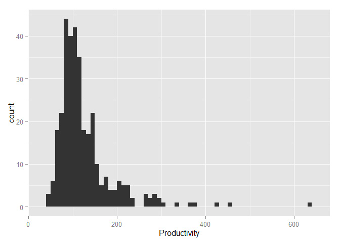

# Replication of Manufacturing Productivity in 2007
Mike Silva  
April 2015  

# Introduction

This study is an attempt to replicate the work of Brunot and Kurrea ^[http://eriedata.bd.psu.edu/AUBER%202012%20Paper--Honolulu--Productivity%20across%20MSAs%20%20FINAL.pdf].  The original paper uses data from the 2007 Economic Census to measure manufacturing sector labor productivity in American metropolitan areas and explores possible determinants of productivity.

# Study Data

## 2007 Economic Census

Consistent with Brunot and Kurrea's works this study uses data from the Econmic Census.  This data was downloaded from American FactFinder.^[2007 Economic Census data downloaded from at http://factfinder.census.gov/] First we read in the Economic Census data.  The first line contains meta data so we skip it.  We initially defined all variables as characters so as to not loose any data.  


```r
econ.census <- read.csv('data/ECN_2007_US_31A1_with_ann.csv',skip=1,colClass=c(rep('character',18))) 
```

There are 363 records initially in the data set.  First we will rename some of the variable names to make them clearer. 


```r
library(dplyr)
econ.census <- econ.census %>%  
  rename(GeoFIPS=Id2) %>%  
  rename(Metro=Geographic.area.name) %>%   
  rename(Value.added=Value.added...1.000.) %>%  
  rename(Production.workers.annual.hours=Production.workers.hours..1.000.) %>%  
  rename(Manufacturing.employment=Number.of.employees) %>%  
  rename(Total.capital.expenditures=Total.capital.expenditures..new.and.used....1.000.)
```

Next we will clean up the metro area names removing the redundant "Metro Area" form each of their names.  


```r
econ.census <- econ.census %>%  
  mutate(Metro = gsub(' Metro Area', '', Metro)) 
```

Next we will change the variable types to numeric.  Nondisclosed data will create NA's in this process.  


```r
econ.census <- econ.census %>%  
  mutate(Value.added=as.numeric(Value.added)) %>%  
  mutate(Production.workers.annual.hours=as.numeric(Production.workers.annual.hours)) %>%  
  mutate(Number.of.establishments=as.numeric(Number.of.establishments)) %>%  
  mutate(Establishments.with.20.employees.or.more=as.numeric(Establishments.with.20.employees.or.more)) %>%  
  mutate(Manufacturing.employment=as.numeric(Manufacturing.employment)) %>%   
  mutate(Total.capital.expenditures=as.numeric(Total.capital.expenditures))
```

### Productivity

Following Brunot and Kurrea's definition, productivity is defined as the value added per hour of production worker labor.  


```r
econ.census <- econ.census %>%  
  mutate(Productivity=Value.added/Production.workers.annual.hours)
```

There are 31 out of 363 MSAs that do not have productivity data.  We will remove them from the study data set.  


```r
econ.census <- econ.census[!is.na(econ.census$Productivity),]
```

### Capital 

We also created the change in capital stock per production worker hour variable using the same definition used by Brunot and Kurrea.  


```r
econ.census <- econ.census %>%  
  mutate(Capital.stock.per.production.worker.hour=Total.capital.expenditures/Production.workers.annual.hours)
```

Of the 332 with productivity  data, 10 did not have capital stock per production worker hour data.  

### Internal Economies of Scale

Employment per establishment is used however we calculated all the same internal economies of scale measures.  


```r
econ.census <- econ.census %>%  
  mutate(Average.empt.per.establishment=Manufacturing.employment/Number.of.establishments) %>%  
  mutate(Percent.est.with.20.plus.employees=(Establishments.with.20.employees.or.more/Number.of.establishments)*100) %>%  
  mutate(Value.added.per.establishment=Value.added/Number.of.establishments)
```

There are 0 metro areas with no average employment per establishment.  

## Population Estimates

The Census Bureau's Population Estimates Program estimates of the population for the metro areas was used in the measure of external economies of scale.

### External Economies of Scale

The 2007 vintage data was downloaded.^[Population estimates downloaded from  http://www.census.gov/popest/data/historical/2000s/vintage_2007/metro.html] First we will pull in the data, rename the variables.  


```r
pop.est <- read.csv('data/CBSA-EST2007-01.csv', skip=2, colClass=c(rep('character',13))) %>%  
  mutate(GeoFIPS=ifelse(Metro.Division.Code=='', CBSA.Code, Metro.Division.Code)) %>%  
  rename(Population=Population.estimates) %>%  
  select(GeoFIPS, Population)
```

The first 3 lines can be dropped as they are blank or descriptive in nature.


```r
pop.est <- pop.est[4:nrow(pop.est),]
```

Now we will change the variable type:


```r
pop.est <- pop.est %>%
  mutate(Population=gsub(',','',Population)) %>%
  mutate(Population=as.numeric(Population))
```

There are 11 record without data so we will drop it.


```r
pop.est <- pop.est[!is.na(pop.est$Population),]
```

There are 968 records in this data set.

## American Community Survey

The American Community Survey (ACS) was used in estimating the educational attainment of the population.  Data was downloaded from American FactFinder^[Table S1501, Educational Attainment. Downloaded from http://factfinder.census.gov/].  The population by age was also downloaded from American FactFinder.^[Table S0101, Age and Sex. Downloaded from http://factfinder.census.gov/]

### Educational Attainment

This data comes from the 2006-2008 American Community Survey.  Like any sample survey, the ACS is a household sample survey and is subject to response and coding error, as well as sampling error.  

First we will pull in the data and rename the variables.  


```r
S1501 <- read.csv('data/ACS_08_3YR_S1501_with_ann.csv',colClass=c(rep('character',231))) %>%  
  rename(GeoFIPS=GEO.id2) %>%  
  rename(High.school.graduates=HC01_EST_VC09) %>%  
  rename(Associate.degree=HC01_EST_VC11) %>%  
  rename(Bachelors.degree=HC01_EST_VC12) %>%  
  rename(Graduate.degree=HC01_EST_VC13) %>%  
  rename(Bachelors.or.higher=HC01_EST_VC15)
```

Next we will drop all unneeded variables and change the data from a character to a number.  


```r
S1501 <- S1501 %>%   
  select(GeoFIPS, High.school.graduates, Associate.degree, Bachelors.degree, Graduate.degree, Bachelors.or.higher) %>%  
  mutate(High.school.graduates=as.numeric(High.school.graduates)) %>%  
  mutate(Associate.degree=as.numeric(Associate.degree)) %>%  
  mutate(Bachelors.degree=as.numeric(Bachelors.degree)) %>%  
  mutate(Graduate.degree=as.numeric(Graduate.degree)) %>%  
  mutate(Bachelors.or.higher=as.numeric(Bachelors.or.higher))
```

There are initially 364 records in this data set.  However the first record contains meta data so we dropped it.


```r
S1501 <- S1501[2:nrow(S1501),]
```

There are now 363 records in this data set.

### Demographics

Those in the 25-34 age group, not long out of  college, and those in the 55-64 age group, those contemplating retirement.  These demographic groups came from the 2006-08 American Community Survey data.


```r
S0101 <- read.csv('data/ACS_08_3YR_S0101_with_ann.csv', skip=1, colClass=c(rep('character',219))) %>%  
  rename(GeoFIPS=Id2) %>%  
  rename(Total.population=Total..Estimate..Total.population) %>%  
  rename(People.25.to.29=Total..Estimate..Total.population...AGE...25.to.29.years) %>%  
  rename(People.30.to.34=Total..Estimate..Total.population...AGE...30.to.34.years) %>%  
  rename(People.55.to.59=Total..Estimate..Total.population...AGE...55.to.59.years) %>%  
  rename(People.60.to.64=Total..Estimate..Total.population...AGE...60.to.64.years) %>%  
  select(GeoFIPS, Total.population, 
         People.25.to.29, People.30.to.34, 
         People.55.to.59, People.60.to.64)
```

Initially there are 363 records.  We will change the type to numeric:


```r
S0101 <- S0101 %>%  
  mutate(Total.population=as.numeric(Total.population)) %>%  
  mutate(People.25.to.29=as.numeric(People.25.to.29)) %>%  
  mutate(People.30.to.34=as.numeric(People.30.to.34)) %>%  
  mutate(People.55.to.59=as.numeric(People.55.to.59)) %>%  
  mutate(People.60.to.64=as.numeric(People.60.to.64))
```

Now we will create the group aggregates and compute the share of total population:  


```r
S0101 <- S0101 %>%  
  mutate(People.25.to.34 = People.25.to.29 + People.30.to.34) %>%  
  mutate(People.55.to.64 = People.55.to.59 + People.60.to.64) %>%  
  select(GeoFIPS, Total.population, People.25.to.34, People.55.to.64)
```

There are 0 metros missing a share of population 25 to 34 and 0 metros missing a share of population 55 to 64 estimate.

## U.S. Patent and Trademark Office

The patent data are from the U.S. Department of Commerce, United States Patent and Trademark Office.  We used data for “utility” patents, the most common kind of patent.  The Patent Office issues reports on the residence of the first named patent holder, which adds the spatial dimension needed for this study. They note that this is probably an imperfect indicator of the location where the patent work was actually done, since in some cases the first-named patent holder might live in a different place than the location of his/her employer where the work was actually done. 

## Innovation

We will scrape the web and pull the metro level data for the number of utility patents.


```r
library(rvest)
pto <- html('http://www.uspto.gov/web/offices/ac/ido/oeip/taf/cls_cbsa/allcbsa_gd.htm') %>%  
  html_nodes('table') %>%  
  html_table() %>%  
  as.data.frame(.) %>%
  rename(GeoFIPS = ID.Code) %>%
  rename(Patents = X2007) %>% 
  select(GeoFIPS, Patents)
```

There are 1025 metros with patent data.  For some reason the PTO GeoFIPS data has a leading 1.  We will remove it:


```r
pto <- pto %>%
  mutate(GeoFIPS = substr(GeoFIPS,2,6))
```

We want to express the figures on a per 100,000 resident basis.  We will merge in the population estimates and computed the scaled patent rate.


```r
pto <- merge(pto, pop.est) %>%  
  mutate(Patents.per.100000=Patents/(Population/100000)) %>%  
  select(-Population)
```

There are 932 metros with patent per 100,000 rates.

## Local Area Personal Income and Employment 

Earnings in each subsector as a share of total earnings in manufacturing in each MSA in 2007 was used as a measure of industry mix.  Data for this variable are from the Bureau of Economic Analysis’s Regional Economic Information System (REIS). ^[Table CA5N download from https://www.bea.gov/regional/downloadzip.cfm]  

The BEA statistical areas are defined by OMB in bulletin no. 13-01 issued February 28, 2013, and the definitions are updated as new information warrants.^[See https://www.bea.gov/regional/docs/msalist.cfm]  These definitions *are not* consistent with those of the 2007 Economic Census.

### Industry Mix

We need the Manufacturing (500 line code) and Nondurable goods manufacturing (530 Line Code) for 2007.


```r
CA5N <- read.csv('data/CA5N_2001_2013_MSA.csv', colClass=c(rep('character',20))) %>%  
  select(GeoFIPS, LineCode, X2007) %>%  
  rename(Value = X2007) %>%  
  filter(ifelse(LineCode %in% c('500','530'), 1, 0)==1)
```

Some of the data has 'E' to represent an estimate.  We have removed them from the data and then converted the data to a number.


```r
library(tidyr)
CA5N <- CA5N %>%  
  mutate(Value = as.numeric(gsub('E','',Value))) %>%  
  spread(LineCode, Value)

names(CA5N) <- c('GeoFIPS','total','nondurable')
CA5N$Percent.nondurable <- (CA5N$nondurable/CA5N$total)*100
```

There are 82 NA's in this data which were removed.


```r
CA5N <- CA5N[!is.na(CA5N$Percent.nondurable), c('GeoFIPS','Percent.nondurable')]
```

We have 381 records with industry mix data.

## Annual Survey of State Government Tax Collections

The Census Bureau's Annual Survey of State Government Tax Collections for 2007 was used to estimate the business tax impacts. ^[Annual Survey of State Government Tax Collections downloaded from http://www.census.gov/govs/statetax/historical_data_2007.html] 

### Business Taxes

We use business taxes paid per employee for 2007. We consider both corporate net income taxes and “occupation and business taxes not elsewhere classified.”  First we will read in the data:


```r
STAXCD <- read.csv('data/07staxcd.txt', colClass=c(rep('character',100)))
```

There are columns with in this dataset that have meta data (i.e. codes for footnotes).  These column's names begin with x (thanks to R's default behavior).  We need to drop these variables


```r
drops <- STAXCD %>%
  select(contains('X')) %>%
  select(-TX) %>%
  names(.)

STAXCD <- STAXCD[,!names(STAXCD) %in% drops]
```

The data is arrange with the states going across and the type of tax going down.  We need to transform the data so the states go down and the tax types go across.  We also only need the corporation net income (T41) and occupation and business taxes nec (T28):


```r
STAXCD <- STAXCD %>%
  gather(Postal.Abbr., value, -ST) %>%
  filter(ifelse(ST=='T41' | ST=='T28',1,0)==1) %>%
  spread(ST, value) %>% 
  rename(Corporation.net.income.taxes=T41) %>%  
  rename(Occupation.and.business.taxes.nec=T28)
```

Then we need to change the variable types:


```r
STAXCD <- STAXCD %>% 
  mutate(Corporation.net.income.taxes=as.numeric(Corporation.net.income.taxes)) %>%  
  mutate(Occupation.and.business.taxes.nec=as.numeric(Occupation.and.business.taxes.nec))
```

We need to merge in the state fips:


```r
STAXCD<- read.csv('data/state.fips.csv', colClass=c(rep('character',3))) %>%
  rename(fipstate = FIPS.Code) %>%
  select(Postal.Abbr., fipstate) %>%
  merge(STAXCD, .)
```

## County Business Patterns

County Business Patterns data was used to scale the state state level business tax metrics referenced in the preceding section. ^[County Business Patterns downloaded from http://www.census.gov/econ/cbp/download/07_data/]  

### Business Taxes (Continued)

Next we will merge in in the county business patterns employment totals( all NAICS).


```r
## Due to GitHub filesize limitations we are not including this data so you will need to download it
if(!file.exists('data/cbp07st.txt')){
  temp <- tempfile()
  download.file('ftp://ftp.census.gov/econ2007/CBP_CSV/cbp07st.zip', temp)
  unzip(temp,'cbp07st.txt')
  done <- file.rename('cbp07st.txt', 'data/cbp07st.txt')
}
STAXCD <- read.csv('data/cbp07st.txt', colClass=c(rep('character',83))) %>%  
  filter(naics == '------') %>%  
  mutate(emp = as.numeric(emp)) %>%  
  select(fipstate, emp) %>%  
  merge(STAXCD, .)
```

Now we can compute the business tax per employee rates:


```r
STAXCD <- STAXCD %>%  
  mutate(Corporate.net.income.tax.per.worker=(Corporation.net.income.taxes*1000)/emp) %>%  
  mutate(Other.business.taxes.per.worker=(Occupation.and.business.taxes.nec*1000)/emp) %>%  
  mutate(Business.taxes.per.worker=Corporate.net.income.tax.per.worker+Other.business.taxes.per.worker) %>%  
  select(-Corporation.net.income.taxes, -Occupation.and.business.taxes.nec, -emp)
```

# Exploratory Analysis

## Productivity


How much does metro manufacturing productivity vary?  It ranges from $43 per hour of labor in El Centro, CA to $638 in Cheyenne, WY.  That is a 15-fold difference.  The following table summarizes the manufacturing productivity values:


|  Productivity  |
|:--------------:|
| Min.   : 42.58 |
| 1st Qu.: 88.44 |
| Median :106.31 |
| Mean   :125.43 |
| 3rd Qu.:141.61 |
| Max.   :637.64 |

Table: Summary of Metro Manufacturing Productivity in 2007

Now to examine which metros are at the top and the bottom of the productivity spectrum.  The following table has the top preformers:  


|      Metro       |  Productivity  |
|:----------------:|:--------------:|
|   Cheyenne, WY   |     637.6      |
| Lake Charles, LA |     455.5      |
|  Alexandria, LA  |     426.4      |
|   Billings, MT   |     375.3      |
|     Lima, OH     |     361.9      |
|   Victoria, TX   |     334.3      |

Table: Most Productive Metros in 2007
  
And this table has the bottom preformers:


|             Metro              |  Productivity  |
|:------------------------------:|:--------------:|
| Houma-Bayou Cane-Thibodaux, LA |     53.46      |
|        Jacksonville, NC        |     51.74      |
|        Lewiston, ID-WA         |     51.28      |
|          Gadsden, AL           |     46.65      |
|           Kokomo, IN           |     46.48      |
|         El Centro, CA          |     42.58      |

Table: Least Productive Metros in 2007

Here's a histogram of metro level manufacturing productivtiy to give a feel for the distribution:  

 

# Study Data

The authors used a subset of the data for their regression models.  We will create the study data by merging together the raw data sources:


```r
study.data <- econ.census %>%  
  select(GeoFIPS, Metro, Productivity, Manufacturing.employment, 
         Average.empt.per.establishment, 
         Percent.est.with.20.plus.employees, 
         Value.added.per.establishment, 
         Capital.stock.per.production.worker.hour) %>%  
  merge(., pop.est, all.x=TRUE) %>%  
  merge(., S0101, all.x=TRUE) %>%  
  merge(., S1501, all.x=TRUE) %>% 
  merge(., pto, all.x=TRUE) %>%  
  merge(., CA5N, all.x=TRUE) %>%  
  select(-Patents, - Total.population)
```

In order to merge in the business taxes data we followed Brunot and Kurre's method of using the state rate for the first state listed in the MSA's name.  To do that I will use a function to pull out the state abbreviation:


```r
get.state.abbr <- function(name){
  name <- strsplit(name, ',')
  name <- name[[1]][2] # Get the state abbreviation
  name <- substr(name, 1, 3) # Get the first 3 characters from the left
  substr(name, 2, 3) # Get the last 2 characters from the right
}

study.data <- study.data %>%  
  group_by(Metro) %>%  
  mutate(state.abbr=get.state.abbr(Metro))
```

Next I will pull in a crosswalk that will let me get the state fips code.^[State FIPS code crosswalk found online at: http://www.bls.gov/cew/cewedr10.htm]  


```r
study.data <- read.csv('data/state.fips.csv', colClass=c(rep('character',3))) %>%
  rename(state.abbr = Postal.Abbr.) %>%
  rename(fipstate = FIPS.Code) %>%
  select(state.abbr, fipstate) %>%
  merge(study.data, .) %>%
  merge(., STAXCD) %>%
  select(-fipstate, -state.abbr) %>%
  arrange(-Productivity)
```

The following is a recreation of the table presented in the origional report.  It provides descriptive statistics of the study data:


|             Variable             |     Unit     |  Count  |  Average  |  Median  |    Max     |  Min   |   Range    |
|:--------------------------------:|:------------:|:-------:|:---------:|:--------:|:----------:|:------:|:----------:|
| Value Added per Prdn Worker Hour |   Dollars    |   331   |   125.4   |   106    |   637.6    | 42.58  |   595.1    |
|            Population            |   # people   |   331   |  710,498  | 238,555  | 18,815,988 | 54,939 | 18,761,049 |
|     Manufacturing Employment     |  # workers   |   331   |  30,625   |  11,764  |  628,771   |  430   |  628,341   |
|  Average Empt per Establishment  |  # workers   |   331   |   44.99   |  43.57   |   149.9    | 6.719  |   143.1    |
|   % of Ests with >20 Employees   |      %       |   331   |   31.53   |  32.46   |    53.4    | 4.688  |   48.72    |
|  Value Added per Establishment   | $ thousands  |   331   |   8,189   |  6,903   |   43,767   |  857   |   42,910   |
|  Patents per 100,000 Population  |  # patents   |   328   |   22.29   |  10.89   |   398.7    |   0    |   398.7    |
|     % High School Graduates      |      %       |   330   |   31.11   |   31.2   |    48.5    |  14.6  |    33.9    |
|        % Associate Degree        |      %       |   330   |   7.918   |   7.8    |     13     |  3.6   |    9.4     |
|       % Bachelor's Degree        |      %       |   330   |   15.8    |  15.65   |    31.7    |  7.5   |    24.2    |
|        % Graduate Degree         |      %       |   330   |   8.976   |    8     |    28.9    |  3.3   |    25.6    |
|      % Bachelor's or Higher      |      %       |   330   |   24.79   |  23.95   |    55.9    |   11   |    44.9    |
|       % 25-34 Years of Age       |      %       |   330   |   13.34   |   13.2   |    18.6    |  10.1  |    8.5     |
|       % 55-64 Years of Age       |      %       |   330   |   10.88   |   11.1   |    14.1    |   6    |    8.1     |
|     Corporate Net Income Tax     | $ per worker |   331   |   402.3   |  371.7   |   3,327    |   0    |   3,327    |
|       Other Business Taxes       | $ per worker |   331   |   92.13   |  72.77   |   607.4    |  14.8  |   592.6    |
|  Sum of Corp I/T & Other Taxes   | $ per worker |   331   |   494.5   |  451.3   |   3,485    |  84.4  |   3,401    |
|   Capital per Prdn Worker Hour   |   Dollars    |   321   |   8.312   |  6.829   |   40.31    | 1.989  |   38.32    |
|           % NonDurable           |      %       |   254   |   37.41   |  35.14   |   93.23    | 1.123  |    92.1    |

Table: Descriptive Statistics for Study Data

# Regresssion Model

Now that we have study data we can create the linear regression models that  the author created.

## Model 1


```r
lm.data <- study.data %>%  
  select(Productivity, Population, Average.empt.per.establishment, Patents.per.100000, Bachelors.degree, People.55.to.64, Corporate.net.income.tax.per.worker, Capital.stock.per.production.worker.hour, Percent.nondurable) %>%  
  mutate(Population.Squared = Population * Population) %>%  
  rename(Employment.per.Establishment = Average.empt.per.establishment) %>%  
  rename(Patents.per.Capita = Patents.per.100000) %>%  
  rename(Percent.Bachelor.Degree = Bachelors.degree) %>%  
  rename(Percent.55.to.64.Yr.Olds =  People.55.to.64) %>%  
  rename(Corp.Income.Tax = Corporate.net.income.tax.per.worker) %>%  
  rename(Capital.per.Prdn.Worker.Hour = Capital.stock.per.production.worker.hour) %>%   
  mutate(Capital.per.Prdn.Worker.Hour.Squared = Capital.per.Prdn.Worker.Hour * Capital.per.Prdn.Worker.Hour) %>%  
  rename(Percent.NonDurables = Percent.nondurable) %>%  
  select(Productivity, Population, Population.Squared, Employment.per.Establishment, Patents.per.Capita, Percent.Bachelor.Degree, Percent.55.to.64.Yr.Olds, Corp.Income.Tax, Capital.per.Prdn.Worker.Hour, Capital.per.Prdn.Worker.Hour.Squared, Percent.NonDurables)

lm.data <- lm.data[complete.cases(lm.data),]

lm.fit <- lm(Productivity ~ ., lm.data)
```

## Model 2


```r
lm2.data <- lm.data %>%
  select(-Patents.per.Capita, -Corp.Income.Tax)

lm2.data <- lm2.data[complete.cases(lm2.data),]

lm2.fit <- lm(Productivity ~ ., lm2.data)
```

## Regression Model Results

----------------------------------------------------------------
                  &nbsp;                    Model 1    Model 2  
------------------------------------------ ---------- ----------
             **(Intercept)**               -80.688*\  -80.306*\ 
                                            (36.682)   (35.733) 

              **Population**                0.000*\    0.000*\  
                                           (0.000)    (0.000)   

          **Population.Squared**            -0.000\    -0.000\  
                                           (0.000)    (0.000)   

     **Employment.per.Establishment**       0.454*\    0.446*\  
                                           (0.195)    (0.188)   

          **Patents.per.Capita**            -0.051\       \     
                                           (0.152)              

       **Percent.Bachelor.Degree**         2.664**\   2.494**\  
                                           (0.997)    (0.854)   

       **Percent.55.to.64.Yr.Olds**         5.040*\    5.044*\  
                                           (2.438)    (2.429)   

           **Corp.Income.Tax**              -0.005\       \     
                                           (0.011)              

     **Capital.per.Prdn.Worker.Hour**      8.886***\  8.805***\ 
                                            (1.878)    (1.864)  

 **Capital.per.Prdn.Worker.Hour.Squared**   -0.091\    -0.088\  
                                           (0.051)    (0.050)   

         **Percent.NonDurables**            0.504*\   0.510**\  
                                           (0.195)    (0.184)   

                  **N**                       246        246    

            **adj. R-squared**               0.360      0.365   
----------------------------------------------------------------

Table: Regression Model Results
